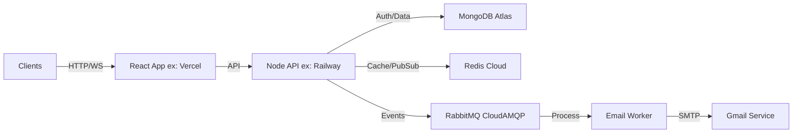

# OrbitOps - Enterprise Task Management System
## Production-Grade MERN Stack Application

[](https://opensource.org/licenses/MIT)
[](https://nodejs.org/)
[](https://www.mongodb.com/)
[](https://redis.io/)
[](https://www.rabbitmq.com/)
[](https://railway.app/)
[](https://vercel.com/)

OrbitOps is a production-ready, enterprise-grade task management system built with the MERN stack. It features real-time collaboration, event-driven architecture, robust RBAC, and automated transactional emails. Designed for high scalability and performance.

---

## 🚀 Key Features

### Core Functionality
- **🔐 Advanced Authentication**:
    - Admin-only user creation (Bcrypt hashing, 12 rounds).
    - JWT-based auth with refresh tokens and Redis-backed blacklisting.
    - Google OAuth2 integration with role segregation.
- **🛡️ Strict Role-Based Access Control (RBAC)**:
    - **Super Admin**: Full system control.
    - **Admin**: Project-level administration and user management.
    - **Manager**: Task assignment and project oversight.
    - **Member**: Personal task execution and updates.
- **💼 Project & Task Management**:
    - Scoped project workspaces with hierarchical membership.
    - Full Task CRUD with workflow statuses (Todo → In Progress → Done).
    - **Late Submission Logic**: Mandatory "Reason for Delay" prompt for overdue tasks marked as 'Done'.
- **⚡ Real-Time Collaboration**:
    - **Socket.IO**: Instant updates for task creation, status changes, and assignments.
    - **Redis Presence**: Live online/offline user status tracking.
- **📧 Transactional Email System**:
    - Automated HTML emails with custom branding (`⌘`) and responsive design.
    - **Flows**: Welcome, Team Invitation, Password Reset, Task Assignment, Project Updates, Admin Approval Requests, Account Activation.

### Technical Architecture
- **Event-Driven**: RabbitMQ event bus decouples core logic from notifications and logging.
- **Microservice-Ready**: Clean separation of concerns (Repositories, Services, Controllers).
- **Performance**: MongoDB compound indexes for efficient pagination and filtering.
- **Security**: Helmet.js, Rate Limiting (Redis), Input Sanitization, CORS configuration.

---

## 📧 Email Notification Flows

The system includes a polished email service handling critical user lifecycle events:

1.  **Onboarding**:
    - `Welcome Email`: Sent upon registration.
    - `Pending Approval`: Sent when a new account awaits Admin review.
    - `Activation Confirmed`: Sent when an Admin approves an account.
2.  **Collaboration**:
    - `Project Invitation`: Secure token-based links for joining teams.
    - `Task Assignment`: Instant notification when a task is assigned.
    - `Project Update`: Alerts for significant project changes.
3.  **Security**:
    - `Password Reset`: Secure, time-limited reset links.
    - `Admin Access Request`: Notifications for role elevation requests.

---

## 🏗️ Architecture & Deployment

### Tech Stack
*   **Frontend**: React (Vite), TypeScript, TailwindCSS, Framer Motion, Zustand, Lucide React, React Hot Toast.
*   **Backend**: Node.js, Express, Mongoose, Passport.js.
*   **Infrastructure**: MongoDB Atlas, Redis Cloud, CloudAMQP (RabbitMQ).
*   **DevOps**: Docker, GitHub Actions (CI), Railway (Backend CD), Vercel (Frontend CD).

### Data Flow


### CI/CD Pipeline
*   **GitHub Actions**:
    *   Triggers on `push` to `main`.
    *   Runs unit tests and linting checks.
    *   Verifies build integrity.
*   **Deployment**:
    *   **Backend**: Automatically deploys to Railway on successful merge & check.
    *   **Frontend**: automatically deploys preview/production builds via Vercel.

---

## 📂 Project Structure

```
Bridgelabz_Task_Management/
├── backend/
│   ├── src/
│   │   ├── config/          # DB, Redis, Rabbit, Logger config
│   │   ├── controllers/     # Request Handlers
│   │   ├── middleware/      # Auth, RBAC, Validation
│   │   ├── models/          # Mongoose Schemas (User, Task, Project)
│   │   ├── services/        # Business Logic & Email Service
│   │   ├── socket/          # Socket.IO Event Handlers
│   │   └── routes/          # API Route Definitions
│   ├── .github/workflows/   # CI/CD Pipelines
│   └── fixSuperAdmin.js     # Admin Maintenance Scripts
├── frontend/
│   ├── src/
│   │   ├── components/      # Reusable UI (Cards, Modals)
│   │   ├── pages/           # Route Views (Dashboard, Tasks)
│   │   ├── store/           # Zustand State (Auth, Socket)
│   │   └── types/           # TS Interfaces
│   └── vite.config.ts
├── docker-compose.yml       # Local Dev Orchestration
└── README.md                # System Documentation
```

---

## 🚀 Quick Start (Local Development)

### Prerequisites
*   Node.js 18+
*   Docker Desktop (for local DBs if not using cloud)
*   Git

### 1. Clone & Configure
```bash
git clone <repository-url>
cd Bridgelabz_Task_Management
# Configure .env files in /backend and /frontend based on examples
```

### 2. Start Application
```powershell
# Using the PowerShell automation script (Windows)
.\start.ps1
```
*This script initializes containers (Mongo, Redis, RabbitMQ) and starts both servers.*

### 3. Access
*   **Frontend**: `http://localhost:5173`
*   **Backend**: `http://localhost:5000`
*   **RabbitMQ**: `http://localhost:15672`

---

## 🛡️ RBAC Permission Matrix

| Action | Super Admin | Admin | Manager | Member |
| :--- | :---: | :---: | :---: | :---: |
| **Manage Users** | ✅ | ✅ | ❌ | ❌ |
| **Create Project** | ✅ | ✅ | ✅ | ❌ |
| **Assign Tasks** | ✅ | ✅ | ✅ | ❌ |
| **Create Task** | ✅ | ✅ | ✅ | ✅ (Self) |
| **Delete Task** | ✅ | ✅ (Project Owner) | ✅ (Project Owner) | ❌ |
| **View Activity** | ✅ | ✅ | ✅ (Own Project) | ✅ (Own) |

---

## 👨‍💻 Author
**Arvind** - *Lead Developer*

Built as a benchmark for high-performance, scalable web application architecture.
OrbitOps © 2026. All rights reserved.
